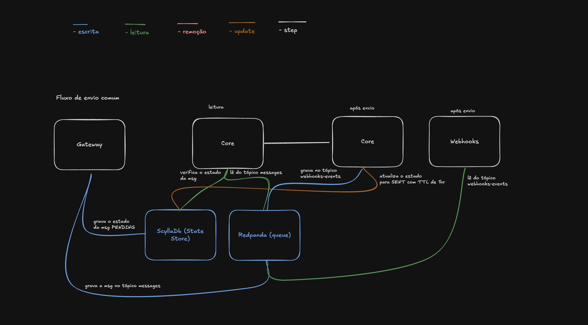
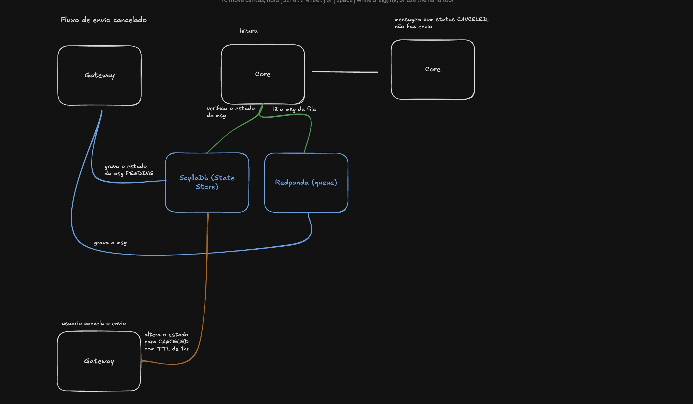

# State-Gated Streaming Architecture

This document describes a design pattern for ultra-high-throughput messaging systems, focused on ensuring state consistency, resilience to disconnections, and high availability through the decoupling of data transport and state management.

---

## 1. Overview

The **State-Gated Streaming Architecture** is based on the principle that the message flow (*Streaming*) must be validated by a *State Gate* at the exact moment of processing. This allows complex decisions—such as real-time cancellations—to be enforced even when queues have millions of accumulated records.

### Core Components

* **Gateway:** Entry microservice responsible for persisting the initial state and publishing the message to the transport layer.
* **Core:** Processing engine that validates the message state in the *State Manager* before any external execution.
* **Webhooks:** Specialized microservice responsible for dispatching event notifications to external consumers.
* **ScyllaDB (State Manager):** Low-latency key-value store that holds the "single source of truth" for the status of each message.
* **Redpanda (Queueing):** Distributed, immutable event log that guarantees message ordering and transport durability.

---

## 2. Operational Flow

### 2.1 Standard Send Flow

1. **State Registration:** The **Gateway** receives the message and records its status as `PENDING` in **ScyllaDB`. This entry is created without a TTL to support devices that may remain offline indefinitely.
2. **Queue Publishing:** The **Gateway** publishes the message to the `messages` topic in **Redpanda**.
3. **Gate Validation:** The **Core** consumes the message from the queue and, before processing it, queries **ScyllaDB** for the current status using the message ID.
4. **Execution and Finalization:**

    * If the status is `PENDING`, the **Core** performs the delivery.
    * After delivery, the **Core** updates the message status to `SENT` in **ScyllaDB** with a **1-hour TTL** and publishes the webhook payload to the `webhooks-events` topic.

### 2.2 Cancellation Flow

1. **State Interruption:** The **Gateway** receives a cancellation request and updates the message status in **ScyllaDB** to `CANCELED` with a **1-hour TTL**.
2. **In-Stream Discard:** When the **Core** eventually consumes this message from the queue—regardless of how much time has passed—it checks the state. If the status is `CANCELED` or the record no longer exists due to TTL expiration, the operation is discarded and no delivery is performed.

---

## 3. Problems Solved by This Architecture

### 3.1 Resource Exhaustion from Tombstones

High-churn systems often suffer performance degradation caused by massive deletions in NoSQL databases. This architecture eliminates the use of `DELETE` operations by relying on short TTLs only at the end of a message’s lifecycle (after success or cancellation), allowing the database to handle cleanup natively and efficiently.

### 3.2 Cancellation Race Conditions

In traditional queue-based systems, it is technically difficult to prevent a message that is already "in transit" from being delivered. The *State-Gated* model solves this by enforcing a state check in the microsecond immediately before final processing, ensuring cancellations are respected even under extreme queue pressure.

### 3.3 Persistence for Offline Instances

By defining the initial state as `PENDING` with no automatic expiration, the architecture ensures that messages destined for clients that remain offline for extended periods are not lost due to application-level timeouts, remaining ready for delivery once connectivity is restored.

### 3.4 Decoupling and Resilience via Webhook Topics

Using a dedicated output topic (`webhooks-events`) provides critical stability benefits:

* **Failure Isolation:** Latency issues or outages in webhook destination servers do not impact the **Core** processing throughput.
* **Native Backpressure:** **Redpanda** acts as a buffer; during massive traffic spikes, the **Webhooks** service can process events at its own pace without data loss.
* **Traceability:** The events topic serves as an immutable audit log of everything successfully processed by the system.

---

## 4. Data Retention and Governance Policies (Redpanda)

Since **ScyllaDB** acts as the definitive *State Manager*, transport logs in **Redpanda** can be aggressively rotated to prevent local storage exhaustion.

### 4.1 Topic: `messages`

Transport channel between the **Gateway** and the **Core**.

* **retention.ms:** Immediate (e.g., 10 minutes).
* **retention.bytes:** 50 GB.
* **Rationale:** Minimizes local disk usage. At volumes of 300k messages per minute, 50 GB provides a safety window for processing spikes without accumulating historical junk.

### 4.2 Topic: `webhooks-events`

Stores delivery results for processing by the **Webhooks** microservice.

* **retention.ms:** 24 hours.
* **retention.bytes:** 300 GB.
* **Rationale:** Allows the Webhooks service to reprocess events in case of critical network failures or maintenance, while maintaining a safeguard against disk exhaustion.

---

## 5. Data Disposal Considerations

In this architecture, the physical "removal" of a message is not an imperative application command, but rather a consequence of configured policies:

* **Immutability:** Messages remain in the log until they reach the configured time or size limits.
* **Consistency:** Even after a log segment is removed from **Redpanda**, the final state (`SENT` or `CANCELED`) remains available in **ScyllaDB** for the duration defined by the TTL (e.g., 1 hour), enabling post-processing audits and validations.

---

# Arquitetura de Streaming com Portão de Estado

Esta documentação descreve um padrão de design para sistemas de mensageria de ultra-alto tráfego, focado em garantir a consistência de estado, resiliência a desconexões e alta disponibilidade através do desacoplamento entre transporte de dados e gestão de estado.

---

## 1. Visão Geral

A **State-Gated Streaming Architecture** baseia-se no princípio de que o fluxo de mensagens (*Streaming*) deve ser validado por um "portão de estado" (*State Gate*) no momento exato do processamento. Isso permite que decisões complexas, como cancelamentos em tempo real, sejam tomadas mesmo em filas com milhões de registros acumulados.

### Componentes Principais

* **Gateway:** Microserviço de entrada responsável por persistir o estado inicial e postar a mensagem no transporte.
* **Core:** Motor de processamento que valida o estado da mensagem no *State Manager* antes de qualquer execução externa.
* **Webhooks:** Microserviço especializado no disparo de notificações de eventos para consumidores externos.
* **ScyllaDB (State Manager):** Armazenamento de chave-valor de baixa latência que detém a "verdade absoluta" sobre o status de cada mensagem.
* **Redpanda (Queueing):** Log de eventos distribuído e imutável que garante a ordem e a persistência do transporte.

---

## 2. Fluxo de Operação

### 2.1 Fluxo de Envio Comum

1. **Registro de Estado:** O **Gateway** recebe a mensagem e grava seu status como `PENDING` no **ScyllaDB**. Esta entrada é feita sem TTL para suportar dispositivos que podem ficar offline por tempo indeterminado.
2. **Postagem em Fila:** O **Gateway** grava a mensagem no tópico `messages` do **Redpanda**.
3. **Validação por Portão (Gate):** O **Core** consome a mensagem da fila e, antes de processá-la, consulta o status no **ScyllaDB** através do ID.
4. **Execução e Finalização:**

    * Se o status for `PENDING`, o **Core** realiza o envio.
    * Após o envio, o **Core** altera o status da mensagem para `SENT` no **ScyllaDB** com **TTL de 1 hora** e grava os dados para envio de webhook no tópico `webhooks-events`.

### 2.2 Fluxo de Cancelamento

1. **Interrupção de Estado:** O **Gateway** recebe uma solicitação de cancelamento e altera o status da mensagem no **ScyllaDB** para `CANCELED` com **TTL de 1 hora**.
2. **Descarte em Fluxo:** Quando o **Core** consome essa mensagem da fila (independente de quanto tempo tenha passado), ele identifica o status no banco (seja como `CANCELED` ou caso o registro não seja encontrado por expiração de TTL) e descarta a operação sem realizar o envio.

---

## 3. Problemas Resolvidos por esta Arquitetura

### 3.1 Exaustão de Recursos por Tombstones

Sistemas de alta rotatividade sofrem com a degradação de performance causada por deleções massivas em bancos NoSQL. Esta arquitetura elimina o uso de comandos `DELETE`, utilizando TTLs curtos apenas no fim do ciclo de vida da mensagem (após sucesso ou cancelamento), permitindo que o banco gerencie a limpeza de forma nativa e eficiente.

### 3.2 Race Conditions em Cancelamentos

Em sistemas de fila tradicionais, é tecnicamente difícil impedir o envio de uma mensagem que já está "em trânsito" dentro da infraestrutura. O modelo *State-Gated* resolve isso forçando uma checagem de status no microssegundo anterior ao processamento final, garantindo que cancelamentos sejam respeitados mesmo em filas sob alta pressão.

### 3.3 Persistência para Instâncias Offline

Ao definir o estado inicial como `PENDING` sem expiração automática, a arquitetura garante que mensagens destinadas a clientes desconectados por longos períodos não sejam perdidas por timeouts de aplicação, permanecendo prontas para envio assim que a conectividade for restaurada.

### 3.4 Desacoplamento e Resiliência via Tópicos de Webhooks

A utilização de um tópico dedicado (`webhooks-events`) para a saída de dados oferece vantagens críticas de estabilidade:

* **Isolamento de Falhas:** Problemas de latência ou quedas nos servidores de destino dos webhooks não impactam a velocidade de envio do **Core**.
* **Backpressure Nativo:** O **Redpanda** atua como um buffer; se houver um pico massivo de envios, o serviço de **Webhooks** pode processar as notificações em seu próprio ritmo, sem perda de dados.
* **Rastreabilidade:** O tópico de eventos serve como um log de auditoria imutável de tudo o que foi processado com sucesso pelo sistema.

---

## 4. Políticas de Retenção e Governança de Dados (Redpanda)

Como o **ScyllaDB** atua como o *State Manager* definitivo, os logs de transporte no **Redpanda** podem ser rotacionados de forma agressiva para evitar a exaustão do armazenamento local.

### 4.1 Tópico: `messages`

Duto de transporte entre o **Gateway** e o **Core**.

* **retention.ms:** Imediato (ex: 10 minutos).
* **retention.bytes:** 50 GB.
* **Justificativa:** Minimiza o uso de disco local. Para volumes de 300k/min, 50 GB garantem uma janela de segurança para picos de processamento sem acumular lixo histórico.

### 4.2 Tópico: `webhooks-events`

Armazena os resultados para processamento do microserviço de **Webhooks**.

* **retention.ms:** 24 horas.
* **retention.bytes:** 300 GB.
* **Justificativa:** Permite que o serviço de Webhooks reprocesse eventos em caso de falhas críticas de rede ou manutenção, mantendo uma trava de segurança contra estouro de disco.

---

## 5. Considerações sobre o Descarte de Dados

Nesta arquitetura, a "remoção" física de uma mensagem não é um comando imperativo da aplicação, mas uma consequência das políticas configuradas:

* **Imutabilidade:** As mensagens permanecem no log até atingirem os limites de tempo ou tamanho definidos no broker.
* **Consistência:** Mesmo após a remoção do log no **Redpanda**, o histórico final (`SENT` ou `CANCELED`) permanece disponível no **ScyllaDB** pelo tempo definido no TTL (ex: 1 hora), permitindo auditorias e validações pós-processamento.
